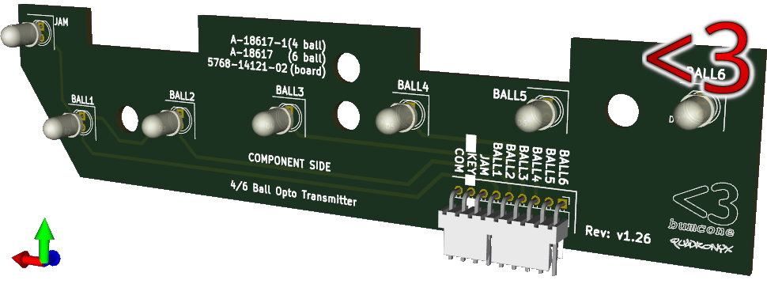

# Pinball Trough Transmitter A-18617 / A-18617-1

-----
# WARNING

**WARNING:** I haven't done a run of these boards yet - they may not be right -
use at your own risk

# WARNING
-----

## Introduction

Pinball LED Trough Transmitter board ( like `5768-14121-02` PCB or `A-18617` /
`A-18617-1` when populated ).

## Supported Games

The following games used the `A-18617` / `A-18618-1` ( `5768-14121-02` PCB )
board:

|Game                       |Edition |Manufacturer  |
|:---                       |:---    |:---          |
|Attack from Mars           |        |Bally         |
|Cactus Canyon              |        |Bally         |
|Champion Pub               |        |Bally         |
|Cirqus Voltaire            |        |Bally         |
|Corvette                   |        |Bally         |
|Indy 500                   |        |Bally         |
|NBA Fastbreak              |        |Bally         |
|Revenge from Mars          |        |Bally         |
|Safe Cracker               |        |Bally         |
|Scared Stiff               |        |Bally         |
|Shadow                     |        |Bally         |
|Theatre of Magic           |        |Bally         |
|Who Dunnit                 |        |Bally         |
|World Cup Soccer           |        |Bally         |
|                           |        |              |
|Congo                      |        |Williams      |
|Dirty Harry                |        |Williams      |
|Flintstones                |        |Williams      |
|Jack Bot                   |        |Williams      |
|Johnny Mnemonic            |        |Williams      |
|Junkyard                   |        |Williams      |
|Medieval Madness           |        |Williams      |
|Monster Bash               |        |Williams      |
|No Fear                    |        |Williams      |
|No Good Gofers             |        |Williams      |
|Roadshow                   |        |Williams      |
|Star Wars Episode 1        |        |Williams      |
|Tales of the Arabian Nights|        |Williams      |
|                           |        |              |
|Attack from Mars (Remake)  |Classic |Chicago Gaming|
|Attack from Mars (Remake)  |Limited |Chicago Gaming|
|Attack from Mars (Remake)  |Special |Chicago Gaming|
|Monster Bash (Remake)      |Classic |Chicago Gaming|
|Monster Bash (Remake)      |Limited |Chicago Gaming|
|Monster Bash (Remake)      |Special |Chicago Gaming|

## LED Alignment

When mounted to a trough ( such as `A-16809-2` ), this board has its LEDs
aligned in the center of the pill shaped openings. This seems to be more like
the alignment of the `A-17982-AI` / `A-17982` board
( `5768-13660-01` PCB ) found in other Williams machines. This seems like a
better spot to put them and for my purpose (homebrew), it does not matter as I
will align the other board accordingly. If however, you were to use these boards
with an existing `A-18618` / `A-18618-1` you'd probably want the LEDs to align
at the bottom, in which case you'd use the
[bottom aligned](https://github.com/bumcone/pinball_trough_transmitter.A-18617/tree/bottom)
version of this board.

## Board design

----
[//]: # ( vim: set ts=4 sw=4 et cindent tw=80 ai si syn=markdown ft=markdown: )
